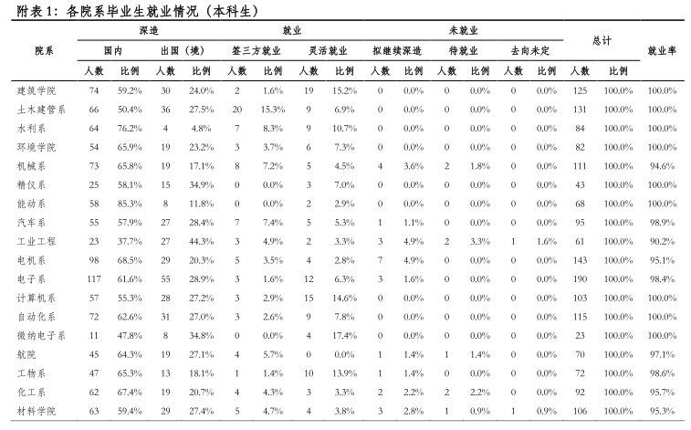
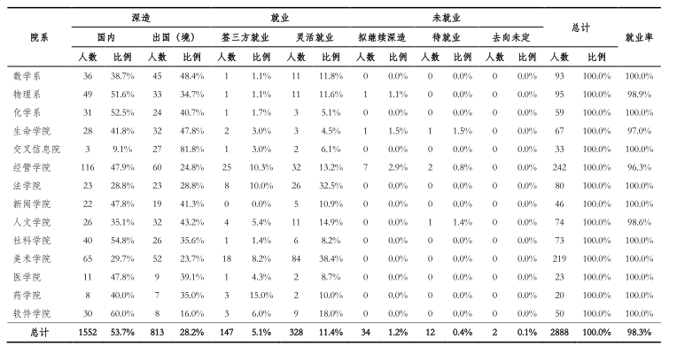

# choose-major-wisely
>收集一些关于选择专业的资料, 以提供信息给对专业了解较少而随便选择专业的同学

# 说明
高中生结束高考后, 忙着填报志愿. 绝大部分高中生对各专业都很少有了解, 很可能因为分数限制, 招生信息,招生老师的引导等等而选择了不适合的专业. 特别是一些十分坑的专业, 想退很难退, 等读完本科,或者是博士, 再转专业, 就很晚了, 浪费了很多时间,精力. 

这里收集的一些文章可能对于某些专业不友好, 但是这就是事实. 真正想在哪些想在那些专业, 想坚持科研的同学是不屑于看这些的, 也是不会轻易动摇的. 所以减少一些不适合某些专业的人数, 将更多资源留给真正热爱的同学, 对于同学们来说是两全其美, 但是对于某些高层可能就不美了.

我以前选专业也是随便选的,完全不了解, 然后看到一个直系学长选了那个专业,我就选了. 后来发现一点也不喜欢, 然后就转了. 这里感谢科大的自由转专业制度.

# 培养方案
学校的培养方案值得看一看, 里面包括培养目标, 培养理念, 以及课程等等
下面给出的是中国科学技术大学的, 其他学校的可以自己搜索官网,进入查看
* [生院](USTC-training-plan/biology.pdf)
* [化院](USTC-training-plan/chemistry.pdf)
* [计院](USTC-training-plan/cs.pdf)
* [地空](USTC-training-plan/earth-and-space.pdf)
* [工院](USTC-training-plan/engineering.pdf)
* [少院](USTC-training-plan/giftd-young.pdf)
* [信院](USTC-training-plan/infomation.pdf)
* [管院](USTC-training-plan/management.pdf)
* [数院](USTC-training-plan/math.pdf)
* [物院](USTC-training-plan/physics.pdf)

# 清华大学2017年本科生去向
硕士, 博士去向以及更多信息可以看[清华大学2017毕业生就业质量报告](Tsinghua-2017/graduate-employment-quality-report.pdf)

    

# 专业选择
[根据什么选专业 洪傲](http://blog.sina.com.cn/s/blog_5406f84d0100gget.html)

[专业的选择应该考虑什么？ - 张翼德的回答 - 知乎](https://www.zhihu.com/question/31946325/answer/53963095)

[文科生如何选择专业？ - 判玩的回答 - 知乎](https://www.zhihu.com/question/21108231/answer/27250483)

# 个人经验
个人经验, 仅供参考.
* 搜集资料: 自己要主动去搜集更多资料,了解更多信息, 同时注意分辨好坏.
* 咨询他人: 个人认为不要咨询招生老师, 高中老师, 可以咨询学长,学姐
* 实践体验: 高考完离填志愿还有一段时间,可以体验某些科目, 比如看些某些专业的专业入门书,做相关实验等等
* ...

# 认识科研
* [科研与工作-庄思源-Qzone](https://user.qzone.qq.com/2980412917/blog/1480411676?_t_=0.2790794687199656)

# 经历与经验
* [留美博士生写给后来人的辛酸回忆：你适合读博士和搞科研吗？_教子砖家梦里江河](http://blog.sina.cn/dpool/blog/s/blog_4ee63ce90102ea4x.html)
* [别人的故事（2） - 弗兰克扬的文章 - 知乎](https://zhuanlan.zhihu.com/p/24543168)

# 生化环材劝退

* [现在学生物出路真有那么不济吗？ - 知乎](https://www.zhihu.com/question/28347460)
* [现在学生物出路真有那么不济吗？-知乎](https://www.zhihu.com/question/28347460)
* [大学的生物专业真的那么坑吗？ - 葉神月的回答 - 知乎](https://www.zhihu.com/question/26106045/answer/76377967)
* [大学的生物专业真的那么坑吗？ - 张浩千的回答 - 知乎](https://www.zhihu.com/question/26106045/answer/37837050)
* [是什么让你开始劝退的？ - 要淡定的回答 - 知乎](https://www.zhihu.com/question/67812985/answer/256891192)
* [是什么让你开始劝退的？ - 贱贱的回答 - 知乎](https://www.zhihu.com/question/67812985/answer/256837300)
* [如何劝高考完的孩子不要选生物专业，而要选择金融和计算机专业？ - you conquer的回答 - 知乎](https://www.zhihu.com/question/31815677/answer/53939577)
* [从事基础科学研究，前景很惨淡吗？ - 知乎](https://www.zhihu.com/question/24308741/answer/27390020)
* [北大化学专业就业如何？ - 知乎](https://www.zhihu.com/question/47997512/answer/108575877)
* [如何看待985贴吧集体对化学的鄙视以及对cs的推崇？ - 葉神月的回答 - 知乎](https://www.zhihu.com/question/38404981/answer/79848997)
* [评化学: 自然科学里最垃圾的学科之一--范昌瑞](http://chuansong.me/n/437013)
* [劝退学导论](https://zhuanlan.zhihu.com/unsa-retribution)
    - [《劝退学导论》大纲 - 到处挖坑蒋玉成的文章 - 知乎](https://zhuanlan.zhihu.com/p/25940780)
    - [《劝退学导论》前言 - 到处挖坑蒋玉成的文章 - 知乎](https://zhuanlan.zhihu.com/p/26527258)
    - [ 《劝退学导论》 第一部分 - 到处挖坑蒋玉成的文章 - 知乎](https://zhuanlan.zhihu.com/p/26647300)
    - [《劝退学导论》第二部分（上） - 到处挖坑蒋玉成的文章 - 知乎](https://zhuanlan.zhihu.com/p/27188243)
    - [《劝退学导论》第二部分（下）更新 - 到处挖坑蒋玉成的文章 - 知乎](https://zhuanlan.zhihu.com/p/28740169)
    
    
# 工具
* [免费职业性格测试](https://www.arealme.com/16types/cn/)

# 贡献
欢迎 fork and pr, 无论是网上的资料,还是你自己的经历经验等, 都可以分享给大家.
